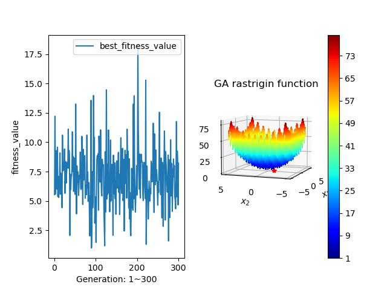

# 智慧型演化計算 HW1-Optimal solution
班級:電子碩一 姓名:王瑞揚 學號:112368018  

## 程式碼說明
將GA包成一個class，方便呼叫使用，在使用時即設定相關參數。  
```python
def __init__(self, pop_size, gene_size, cross_rate, mutation_rate, max_gen, func, upper, lower, extremum, show_mode):
    self.pop_size = pop_size               # 總染色體數
    self.gene_size = gene_size             # 染色體
    self.cross_rate = cross_rate           # 交配率
    self.mutation_rate = mutation_rate     # 突變率
    self.max_gen = max_gen                 # 最大迭代次數
    self.pop = []                          # 染色體群體
    self.fitness_value = []                # 個體分數
    self.mating_pool = []                  # 交配池

    self.func = func                       # 欲執行的函式名稱
    self.upper = upper                     # 搜索範圍上限
    self.lower = lower                     # 搜索範圍下限
    self.extremum = extremum               # 找最大或最小值
    self.best_result = []                  # 每一代的最佳fitness_value
    self.best_parameter = []               # 每一代最佳fitness_value的參數

    self.show_mode = show_mode             # 執行時是否在終端顯示執行log
```
因為是binary的GA，所以需要decode函式，會將只有1或0的list轉為一組在上下限範圍內的值($x_1$, $y_1$)。  
```python
def decode(self, pop:list):
    """將染色體內的二進制資料轉為搜索範圍內的值

    Args:
        pop (list): 一次一個pop進來，格式為[1,0,0,1,1]

    Returns:
        list: [x1,y1]
    """
    decimal_1 = ''
    decimal_2 = ''
    # 因有兩個參數，故將基因分成前後兩段
    for index in range(self.gene_size // 2):  # 前半段
        decimal_1 += str(pop[index])
    for index in range(self.gene_size // 2):  # 後半段
        decimal_2 += str(pop[index + self.gene_size // 2])

    decimal_1 = int(str(decimal_1),2)                           # binary to decimal
    decimal_2 = int(str(decimal_2),2)

    decimal_1 = float(decimal_1) / (2 ** (self.gene_size//2))   # normalization to 0 ~ 1
    decimal_2 = float(decimal_2) / (2 ** (self.gene_size//2))

    result_1 = decimal_1 * (self.upper-self.lower) + self.lower # 線性轉換成上下限範圍內的值
    result_2 = decimal_2 * (self.upper-self.lower) + self.lower

    return [result_1, result_2]
```
使用initialization()產生初始染色體群體。  
```python
def initialization(self):
    """產生初始population
    """
    for i in range(self.pop_size):
        temp_pop = []
        for j in range(self.gene_size):
            temp_pop.append(random.choice([0, 1]))
        self.pop.append(temp_pop)
```
使用evaluation()來評估個體的分數，首先先決定要計算哪個群體，接著將染色體內的基因解碼後代入指定的function，取得一數值就是該染色體之個體分數。  
```python
def evaluation(self, group:str):
    """計算每個pop帶入function內的值

    Args:
        group (str): 輸入要計算哪個群體:'pop' or 'mating_pool'
    """
    if group == 'pop':
        population = self.pop
    elif group == 'mating_pool':
        population = self.mating_pool

    self.fitness_value = []
    for pop in population:
        result = self.decode(pop)
        value = self.func(result[0], result[1])
        self.fitness_value.append(value)
```
使用selection_by_RWS()來產生個別染色體的機率，並抽選至交配池內，此處採用softmax的方式來產生機率。  
```python
def selection_by_RWS(self):
    """利用softmax計算出個別的機率後，用輪盤法抽選至交配池內
    """
    def softmax_max(x):
        x = [xi-max(x) for xi in x]
        e_x = [np.exp(-xi) for xi in x]
        return [x/sum(e_x) for x in e_x]
    def softmax_min(x):
        x = [xi-max(x) for xi in x]
        e_x = [np.exp(xi) for xi in x]
        return [x/sum(e_x) for x in e_x]

    if self.extremum == 'min' and sum(self.fitness_value) == 0:
        self.mating_pool = self.pop
    elif self.extremum == 'min':
        probability = softmax_min(self.fitness_value)
    elif self.extremum == 'max':
        probability = softmax_max(self.fitness_value)

    for _ in range(self.pop_size):
        random_pop = random.choices(self.pop, weights=probability)[0]
        random_pop = list(random_pop)
        self.mating_pool.append(random_pop)
```
使用crossover()來執行交配行為，先將交配池順序打亂，接著兩兩一組決定是否交配，接著再決定要交配的是x變數還是y變數(染色體內前半段為x，後半段為y)，決定變數後再決定交換的位置。  
```python
def crossover(self):
    """交配池內的染色體進行交配
    """
    def swap_func(a,b):
        temp = a
        a = b
        b = temp
        return a,b
    
    shuffle_mating_pool = np.random.permutation(self.mating_pool) # 打亂mating_pool順序
    shuffle_mating_pool = [list(x) for x in shuffle_mating_pool]  # 轉為list

    for i in range(0, len(shuffle_mating_pool), 2):
        cr = random.uniform(0,1)
        if cr < self.cross_rate:
            x_or_y = random.choice([0,1]) # 決定要交換x或y  0:x, 1:y
            cross_location = int(np.random.uniform(1, self.gene_size//2 + 1)) # 決定要從哪邊開始交換(uniform)
            if x_or_y == 0:
                shuffle_mating_pool[i][cross_location-1:self.gene_size//2], shuffle_mating_pool[i+1][cross_location-1:self.gene_size//2] = swap_func(shuffle_mating_pool[i][cross_location-1:self.gene_size//2], shuffle_mating_pool[i+1][cross_location-1:self.gene_size//2])
            else:
                shuffle_mating_pool[i][cross_location-1+self.gene_size//2:], shuffle_mating_pool[i+1][cross_location-1+self.gene_size//2:] = swap_func(shuffle_mating_pool[i][cross_location-1+self.gene_size//2:], shuffle_mating_pool[i+1][cross_location-1+self.gene_size//2:])
            
    self.mating_pool = shuffle_mating_pool
```
使用mutation()來執行突變行為，遍歷交配池內的每個染色體，每條染色體中的基因都有機會發生突變。  
```python
def mutation(self):
    """交配池內的染色體進行突變
    """
    for p in self.mating_pool:
        for i in range(self.gene_size):
            mr = random.uniform(0,1)
            if mr < self.mutation_rate:
                if p[i] == 0:
                    p[i] = 1
                else:
                    p[i] = 0
```
使用execute()作為程式主要的執行流程，將上述函式整理成一個流程。  
```python
def execute(self):
    self.initialization()
    self.evaluation('pop')
    for gen in range(1, self.max_gen+1):
        self.selection_by_RWS()
        self.crossover()
        self.mutation()
        self.evaluation('mating_pool')

        if self.extremum == 'max':
            best_fitness = max(self.fitness_value)
        elif self.extremum == 'min':
            best_fitness = min(self.fitness_value)
        self.best_result.append(best_fitness)

        index = self.fitness_value.index(best_fitness)   # 取得index
        parameter = self.decode(self.mating_pool[index]) # 轉為real value
        self.best_parameter.append(parameter)
        if self.show_mode:
            print(f'Generation {gen}:')
            print(f"    best_value: {best_fitness:.4f}    parameter: {parameter[0]:.4f}, {parameter[1]:.4f}")
        self.pop = self.mating_pool  # replace
        self.clean()
    
    self.plot_iteration_result()
    self.plot_best_result()
```
`ga.py`內須注意的地方為POP_SIZE需為偶數，因為crossover那邊會用到，另一個是gene_size = GENE_SIZE*2，這邊\*2的原因是染色體內有兩個變數，所以我的GENE_SIZE是表示一個變數。  
```python
if run_select == 1:
    POP_SIZE = 100   # even number for crossover
    GENE_SIZE = 10
    CROSS_RATE = 0.8 # 0.8 to 0.6
    MUTATION_RATE = 0.2
    MAX_GEN = 100
    UPPER_BOUNDARY = 3
    LOWER_BOUNDARY = -3
    EXTREMUM = 'min'

    ga_rosenbrock = GeneticAlgorithm(pop_size = POP_SIZE, 
                        gene_size = GENE_SIZE*2, 
                        cross_rate = CROSS_RATE, 
                        mutation_rate = MUTATION_RATE,
                        max_gen = MAX_GEN,
                        func = rosenbrock,
                        upper = UPPER_BOUNDARY,
                        lower = LOWER_BOUNDARY,
                        extremum = 'min',
                        show_mode = True)
    ga_rosenbrock.execute()
```
在執行`ga.py`時，只需修改run_select變數以及相關參數，即可執行不同的function。  

<div style="page-break-after: always;"></div>

## 執行結果
---
### rosenbrock
GENE_SIZE = 10固定不變
- POP_SIZE = 100, CROSS_RATE = 0.6,  MUTATION_RATE = 0.2, MAX_GEN = 100


- POP_SIZE = 100, CROSS_RATE = 0.8,  MUTATION_RATE = 0.2, MAX_GEN = 100


- POP_SIZE = 100, CROSS_RATE = 0.8,  MUTATION_RATE = 0.2, MAX_GEN = 200


- POP_SIZE = 100, CROSS_RATE = 0.8,  MUTATION_RATE = 0.2, MAX_GEN = 500


- POP_SIZE = 100, CROSS_RATE = 0.8,  MUTATION_RATE = 0.4, MAX_GEN = 100


- POP_SIZE = 200, CROSS_RATE = 0.8,  MUTATION_RATE = 0.2, MAX_GEN = 100


- POP_SIZE = 300, CROSS_RATE = 0.8,  MUTATION_RATE = 0.2, MAX_GEN = 100

---
### eggholder
POP_SIZE = 200, GENE_SIZE = 16固定不變
- CROSS_RATE = 0.6,  MUTATION_RATE = 0.2, MAX_GEN = 300


- CROSS_RATE = 0.6,  MUTATION_RATE = 0.4, MAX_GEN = 300


- CROSS_RATE = 0.8,  MUTATION_RATE = 0.2, MAX_GEN = 300


- CROSS_RATE = 0.8,  MUTATION_RATE = 0.2, MAX_GEN = 500

---
### himmelblau
POP_SIZE = 200, GENE_SIZE = 16固定不變
- CROSS_RATE = 0.6,  MUTATION_RATE = 0.2, MAX_GEN = 300


- CROSS_RATE = 0.8,  MUTATION_RATE = 0.2, MAX_GEN = 300


- CROSS_RATE = 0.8,  MUTATION_RATE = 0.4, MAX_GEN = 300


- CROSS_RATE = 0.8,  MUTATION_RATE = 0.4, MAX_GEN = 500

---
### rastrigin
POP_SIZE = 200, GENE_SIZE = 16, MAX_GEN = 300固定不變
- CROSS_RATE = 0.6,  MUTATION_RATE = 0.2


- CROSS_RATE = 0.8,  MUTATION_RATE = 0.2


- CROSS_RATE = 0.8,  MUTATION_RATE = 0.4

---
<div style="page-break-after: always;"></div>

## 成果說明
- rosenbrock:  
    提升POP_SIZE為200或300 & 降低CROSS_RATE至0.6 & 提升MAX_GEN至200或500看起來效果都差不多，都很容易掉入local minimum裡面，將MUTATION_RATE提升至0.4後更容易到達最低點。

- eggholder:  
    觀察執行結果發現常常最佳點都出現在右上或左上，此題感覺比較難找到最佳點，多次修改參數，結果都不相同。

- himmelblau:  
    此function的低點在四個象限，我實作出來的結果大多都在一、二和四象限，第三象限幾乎沒有出現。

- rastrigin:  
    這題最低點應該會在[0,0]的地方，而我實作的結果大多都在[-1,1]之間，算接近了，但仍不是最佳。

## 心得
- 透過這次的作業，讓我了解到如何實作GA演算法，也對於GA演算法的流程更加的熟悉，未來若遇到可以轉為方程式的問題，就可以用這個方法來求解。這個方法參考生物的演化我覺得很有趣，交配與突變這個過程，就像現實中自己往自己所認為對的方向前進，殊不知因為自己的視野範圍小所以是往local的最佳值前進，此時就需要旁人的提醒或自身的醒悟來改變方向，往global最佳值前進。