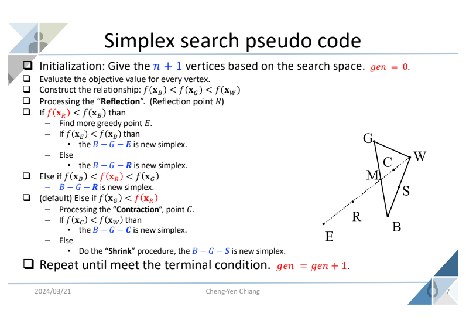
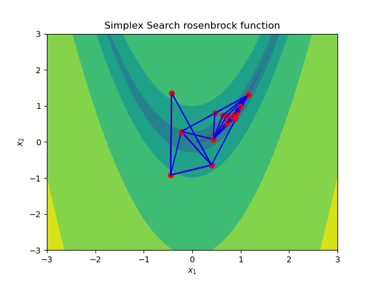
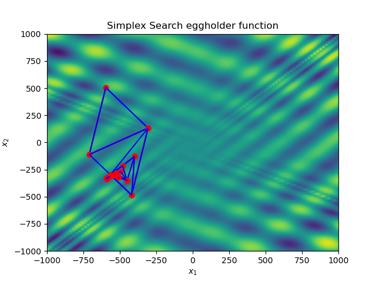
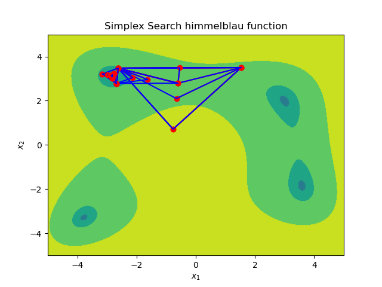
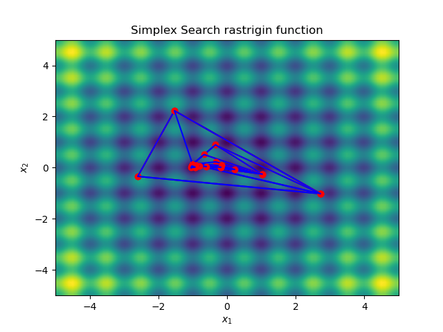

# 智慧型演化計算 HW2-Optimal solution
班級:電子碩一 姓名:王瑞揚 學號:112368018  

## 程式碼說明
將simplex包成一個class，方便呼叫使用。  
```python
class simplex:
    def relationship(self, points:dict):
        temp = []
        for _,v in points.items():
            temp.append(v)
        temp.sort()
        for k,v in points.items():
            if v == temp[0]:
                self.b = k
            elif v == temp[1]:
                self.g = k
            elif v == temp[2]:
                self.w = k
        print(f'B: {self.b}\nG: {self.g}\nW: {self.w}')
    
    def calc_m(self):
        x = (self.g[0] + self.b[0])/2
        y = (self.g[1] + self.b[1])/2
        self.m = (x,y)

    def reflection(self):
        x = (self.m[0] - self.w[0])
        y = (self.m[1] - self.w[1])
        rx = self.m[0] + x
        ry = self.m[1] + y
        self.r = (rx,ry)
        print(f'R: {self.r}')

    def expansion(self):
        x = (self.m[0] - self.w[0])*2
        y = (self.m[1] - self.w[1])*2
        ex = self.m[0] + x
        ey = self.m[1] + y
        self.e = (ex,ey)
        print(f'E: {self.e}')
    def contraction(self):
        x = (self.m[0] - self.w[0])*0.5
        y = (self.m[1] - self.w[1])*0.5
        cx = self.w[0] + x
        cy = self.w[1] + y
        self.c = (cx,cy)
        print(f'C: {self.c}')
    def shrink(self):
        x = (self.w[0] + self.b[0])/2
        y = (self.w[1] + self.b[1])/2
        self.s = (x,y)
        print(f'S: {self.s}')
```
以`simplex_rosenbrock.py`為例，前面先def會用到的函數，其中new_simplex是將3個點帶入，會回傳字典，格式為{tuple:float,tuple:float,tuple:float}，例如:{(-1.53225806451613, 2.229437229437231): 35.825099027806104, (-2.600806451612904, -0.34090909090909083): 40.34710401611178, (2.721774193548386, -1.0173160173160172): 20.26631286368995}，tuple是點的x,y值，float為object_value，回傳的字典則給後續創建新的simplex使用。
```python
def rosenbrock(x1, x2):
    return 100*(x2-x1**2)**2 + (1-x1)**2

def plot_value():
    ax.contourf(X1, X2, all_value, norm=LogNorm(), levels=50, alpha=0.9)
    ax.set_title(f'Simplex Search rosenbrock function')
    ax.set_xlabel('$x_1$')
    ax.set_ylabel('$x_2$')

def evaluate_object_value(points):
    return rosenbrock(points[:, 0], points[:, 1])

def new_simplex(p1:tuple,p2:tuple,p3:tuple):
    temp_dict = {}
    temp_dict[p1] = rosenbrock(p1[0], p1[1])
    temp_dict[p2] = rosenbrock(p2[0], p2[1])
    temp_dict[p3] = rosenbrock(p3[0], p3[1])
    return temp_dict
```
接著為初始設定區，設定範圍等相關參數，以及初步的畫圖。  
```python
LOWER = -3
UPPER = 3
MAXGEN = 15
x1 = np.linspace(LOWER, UPPER, 100)
x2 = np.linspace(LOWER, UPPER, 100)
X1, X2 = np.meshgrid(x1,x2)
all_value = rosenbrock(X1,X2)
```
<div style="page-break-after: always;"></div>

接著為initial_state，先創建新圖，將剛剛計算的結果畫出，讓使用者點3個點，畫出3點連線結果，將point和其object_value建成字典供後續使用。   
```python
fig, ax = plt.subplots()
plt.ion()   # 開啟 interactive mode

plot_value()
points = fig.ginput(3)   # 讓使用者點3個點
print(f'points: {points}')
points = np.array(points)
plot_value()
ax.plot(points[:, 0], points[:, 1], marker='o', color='red') 
ax.plot(points[[0, 1, 2, 0], 0], points[[0, 1, 2, 0], 1], color='blue')
plt.show()

obj_value = evaluate_object_value(points)
print(f'object_value: {obj_value}')

obj_dict = {}
for point in points:
    obj_dict[tuple(point)] = rosenbrock(point[0], point[1])
print(f'object_dict: {obj_dict}')
```
接著為主要迭代迴圈部分，此部分參考上課投影片之simplex search pseudo code進行實作。  

```python
simp = simplex()
for gen in range(0,MAXGEN):
    simp.relationship(obj_dict)
    simp.calc_m()
    simp.reflection()
    if rosenbrock(simp.r[0],simp.r[1]) < rosenbrock(simp.b[0],simp.b[1]):
        simp.expansion()
        if rosenbrock(simp.e[0],simp.e[1]) < rosenbrock(simp.b[0],simp.b[1]):
            obj_dict = new_simplex(simp.b, simp.g, simp.e)
        else:
            obj_dict = new_simplex(simp.b, simp.g, simp.r)
    elif rosenbrock(simp.b[0],simp.b[1]) < rosenbrock(simp.r[0],simp.r[1]) and rosenbrock(simp.r[0],simp.r[1]) < rosenbrock(simp.g[0],simp.g[1]):
        obj_dict = new_simplex(simp.b, simp.g, simp.r)
    elif rosenbrock(simp.g[0],simp.g[1]) < rosenbrock(simp.r[0],simp.r[1]):
        simp.contraction()
        if rosenbrock(simp.c[0],simp.c[1]) < rosenbrock(simp.w[0],simp.w[1]):
            obj_dict = new_simplex(simp.b, simp.g, simp.c)
        else:
            simp.shrink()
            obj_dict = new_simplex(simp.b, simp.g, simp.s)

    points = [simp.b, simp.g, simp.w]
    points = np.array(points)
    plot_value()
    ax.plot(points[:, 0], points[:, 1], marker='o', color='red') 
    ax.plot(points[[0, 1, 2, 0], 0], points[[0, 1, 2, 0], 1], color='blue')
    plt.pause(0.5)
    plt.show()
```
最後將程式執行結果存檔。  
```python
if not os.path.exists(f'./img/rosenbrock'):
    os.makedirs(f'./img/rosenbrock')

plt.savefig(f'./img/rosenbrock/rosenbrock_{MAXGEN}.png')
``` 
<div style="page-break-after: always;"></div>

## 執行結果
---
### rosenbrock

---
### eggholder

---
### himmelblau

---
### rastrigin

---

<div style="page-break-after: always;"></div>

## 心得
- 透過這次的作業，讓我了解到如何實作simplex search演算法，也對於simplex search演算法的流程更加的熟悉，在過程中看到三角形跑來跑去，逐漸往較佳的方向去時，覺得非常有趣。在測試的過程中發現，起手點的3個位置非常重要，它會決定是否能夠找到最佳解，和GA相比，我比較喜歡GA，因為只要把population或generation提升，就有較高的機會找到最佳解。